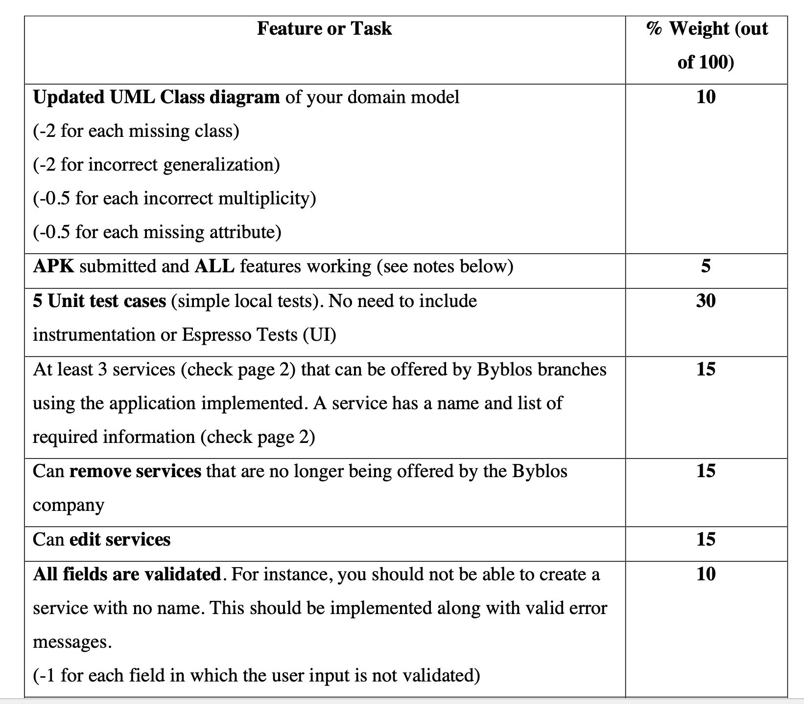

# SEG2105 Project Group_32

Project_group 32 Repository Link: https://github.com/SEG2105-uottawa/seg2105f21-project-project_gr32

# Deliverable2 Explanation 
Based on the marking scheme, we assume the functionalities that must be implemented for deliverable2 are: deleteService, addService, and editService. 
For deleteBranch and deleteCustomer accounts, we will implement them later into next stage. In order to implement deleteBranch, we need Branch as a class and implement relative functionality, which will be covered in next deliverable. Also, note that service requirements have not been implemented due to time constraints, and will be added later.

# Members

Zijun Ye 300168065

Zeyu Shao 300166803

Selin Kararmaz 300163876

Thulam Tran 300185320

Samuel Okakwu 300200869
